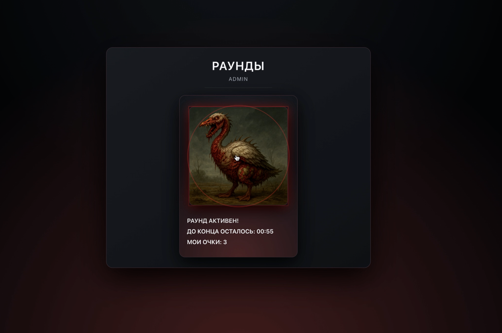

<p align="center">
  
</p>

<h1 align="center">The Last of Guss</h1>

<p align="center">
  Мрачная веб-игра на реакцию: натапай по мутировавшему гусю G-42 быстрее других игроков.
</p>

---

## 🧬 Описание

**The Last of Guss** — браузерная мини-игра, где игроки соревнуются в раундах:
кто больше раз успеет кликнуть по мутировавшему гусю за ограниченное время.

Приложение состоит из трёх основных экранов:

1. **Авторизация**

   - Вход по имени и паролю.
   - При первом логине пользователь автоматически создаётся.
   - Если пользователь уже существует и пароль не совпадает — показывается ошибка.
   - Тестовый админ-пользователь:
     - `username: admin`
     - `password: pass`

2. **Список раундов**

   - Отображение активных и запланированных раундов.
   - Для каждого раунда:
     - `Round ID` (ссылка на страницу раунда),
     - время начала и конца,
     - статус: `Активен`, `Cooldown`, `Завершен`.
   - Кнопка **«Создать раунд»** доступна только администратору; после создания он сразу попадает на страницу нового раунда.

3. **Страница раунда**
   - Большой мутировавший гусь, по которому можно тапать, если раунд активен.
   - Состояние раунда:
     - `Активен` — таймер до конца раунда, счёт пользователя.
     - `Cooldown` — таймер до старта.
     - `Завершен` — итоговая статистика, победитель и мой счёт.
   - При клике по гусю — короткая анимация «удара» в хоррор-стилистике.

---

## 🛠️ Стек и архитектура

- **Frontend**

  - React + TypeScript + Vite
  - React Router
  - Ant Design (UI-компоненты)
  - MobX (стор пользователя и состояние игры)
  - @tanstack/react-query (работа с API, кеширование)
  - moment.js (работа с датами и таймерами)
  - SCSS + БЭМ (кастомные стили, тёмная хоррор-тема)

- **Архитектура**
  - Feature-Sliced Design:
    - `app/` — провайдеры, роутинг, StoreProvider
    - `pages/` — страницы (`LoginPage`, `RoundsPage`, `RoundPage`)
    - `widgets/` — крупные виджеты (`PageHeader`, `Header`)
    - `features/` — функциональные фичи (авторизация, список раундов, гусь, создание раунда и т.д.)
    - `shared/` — API-слой, UI, сторы, утилиты, стили

---

## 🚀 Запуск проекта

```bash
# Установка зависимостей
npm install

# Локальный режим разработки
npm run dev

# Линт
npm run lint

# Production-сборка
npm run build

# Превью production-сборки
npm run preview
```
